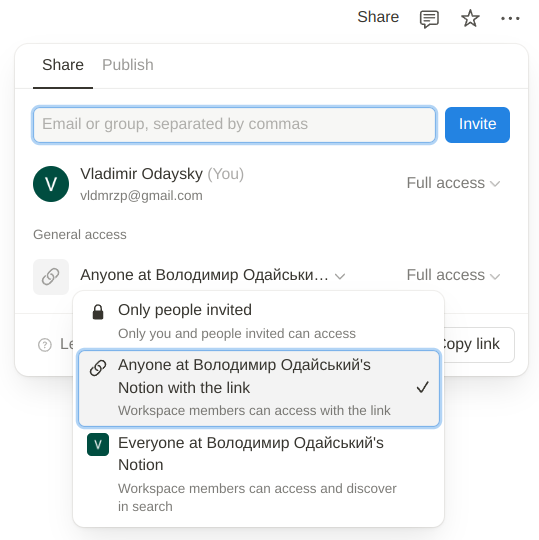
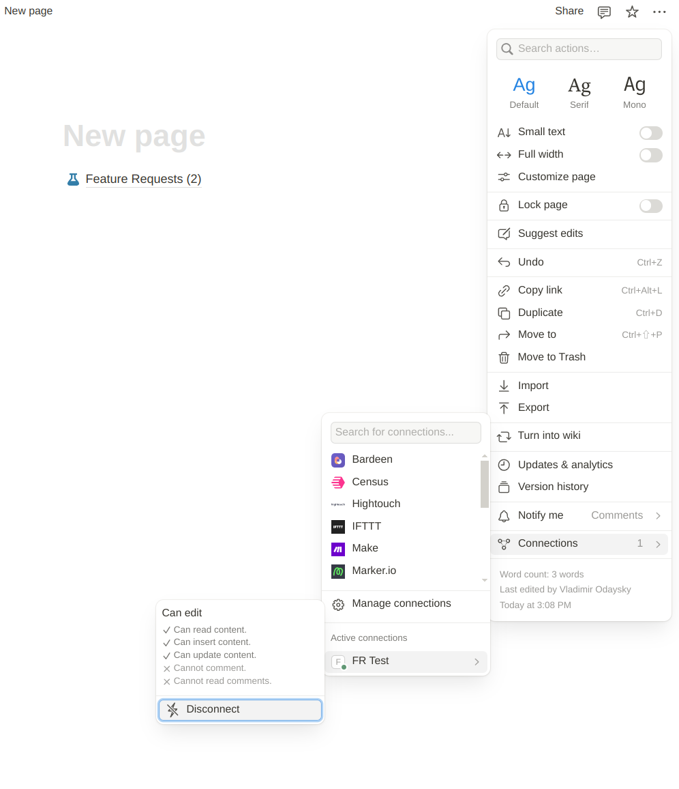
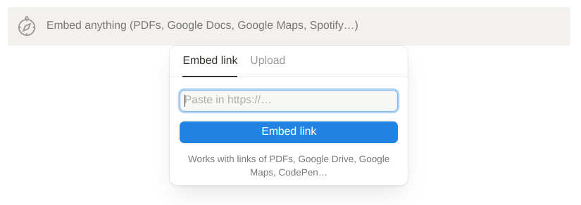

# Feature Requests

Notion integration that allows easy creation of feature request pages.

## How It Works?

This repository contains a simple HTTP API that interacts with Notion through `integrations`.
Navigate to [notion developer portal](https://www.notion.so/profile/integrations/) to create a new integration 
and receive an API key. This repository also contains a Vue application, that renders a form and calls the backend APIs, 
and is served by the same API as static files.
It is meant to be embedded into Notion page as an iframe. When form is submitted, it will create a new entry in linked
Notion database widget.

## Configuration

create .env file in the `backend` folder with the following content:

```
notion_db=<UUID of notion database>
notion_secret=<API key from notion integration>
api_secret=<arbitrary API secret to be matched by iframe inside notion>
slack_webhook=<URL of slack webhook, optional>
```

## Creating a Notion Database

Make sure target Notion page is not private (share the page with workspace) and has the integration enabled.




Now, get the UUID of the page where you want your feature requests to be stored: copy the UUID from the page URL:
notion.so/**d6eb091e7de645adb576cb589f0caf58**?v=...

You can now create a database on that page by running 

`python -m shell create-db <page UUID> <page title>`
(Use `make cli`)

Save the UUID of the database in the .env file (`notion_db`).


## Running

Run `make run` to start the server on port 8000. 
You can reach the form at `http://localhost:8000/index.html?auth=<api_secret>`

## Inserting form into Notion

To insert the form into the Notion page, you need to create an iframe with the following URL:
`https://<...>/index.html?auth=<api_secret>`
In order to be embedded, API has to be hosted on a server with SSL enabled (https).



For testing purposes, inserting iframe into Notion is not required.
